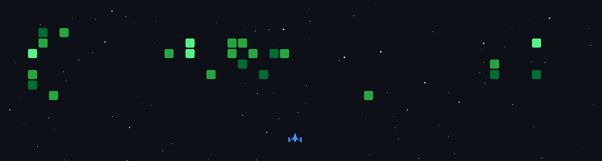

# 💫 About Me:
🚀 I’m currently working on Building real-world full-stack projects using React, Node.js, and MySQL, while improving my backend workflows through hands-on projects.  🤝 I’m looking to collaborate on Open-source projects and practical web applications where I can learn and contribute at the same time.  🧠 I’m looking for help with Backend design, writing cleaner APIs, and understanding how real production systems are structured.  🌱 I’m currently learning Modern backend development, Flask, Node.js best practices, and improving my full-stack skills.  💬 Ask me about React, Node.js, MySQL, full-stack development basics, GitHub, and project building.  ⚡ Fun fact I learn faster by building projects than by just watching tutorials.

## 🌐 Socials:
     

# 💻 Tech Stack:
                     
# 📊 GitHub Stats:

  

 
 

### ✍️ Random Dev Quote

### 🔝 Top Contributed Repo

---

<!-- Proudly created with GPRM ( https://gprm.itsvg.in ) -->
